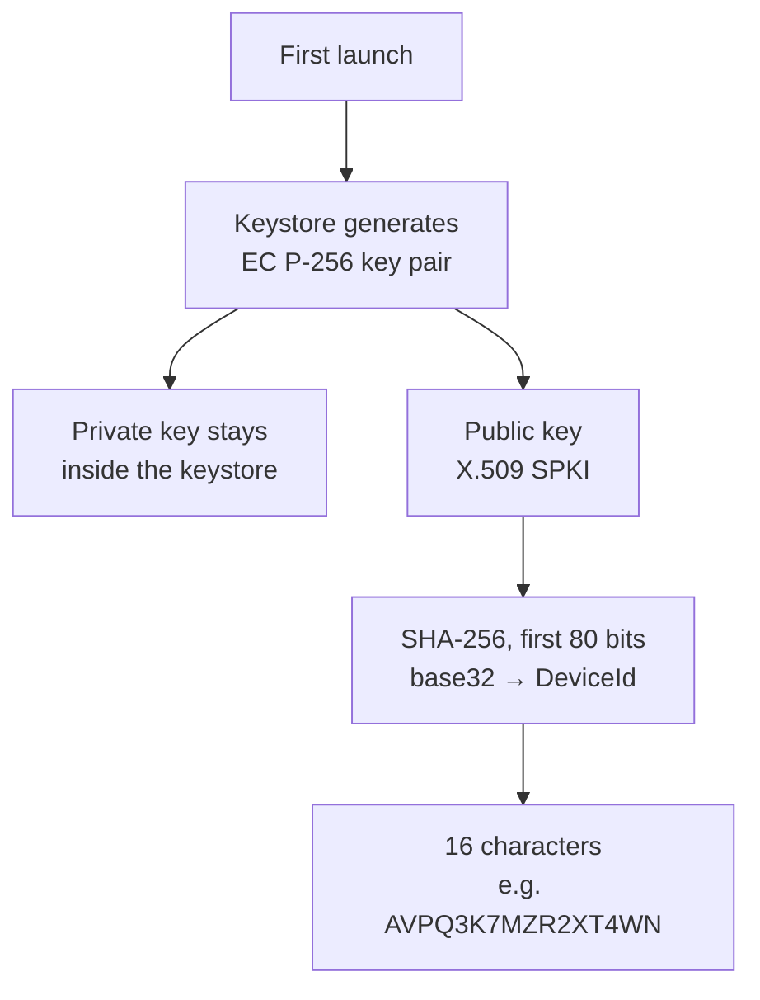
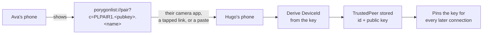
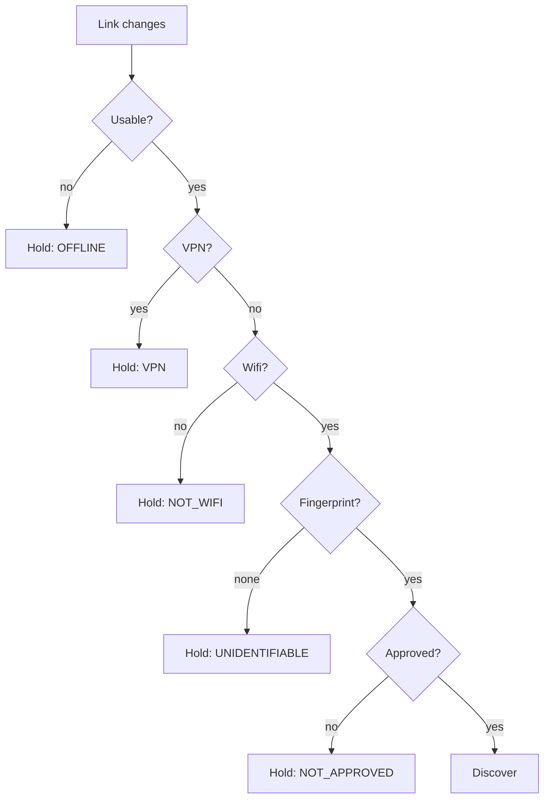
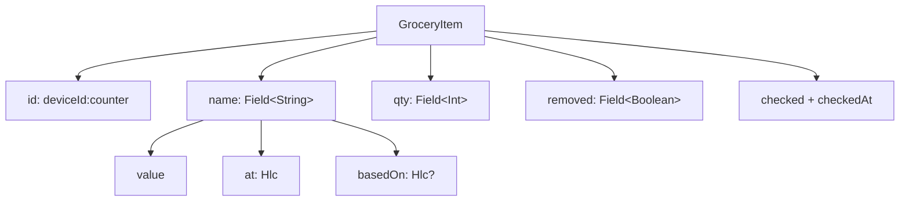
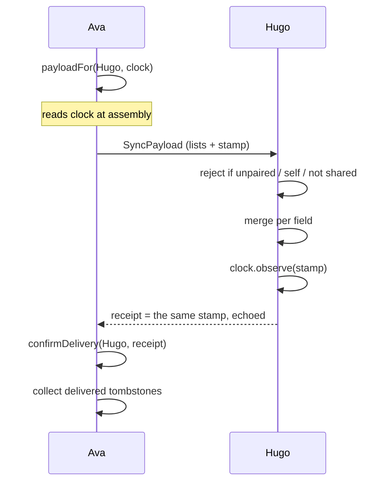
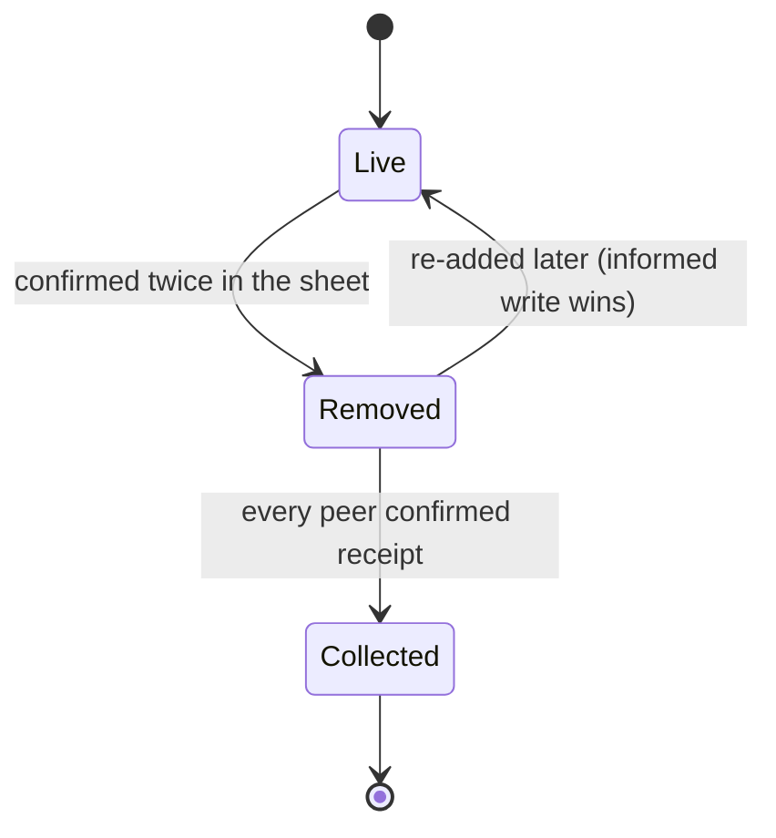

# PorygonList — architecture and status

Written 2026-09-17. This is the state of the project after the design import and
the sync foundations, and what remains before two phones can actually talk.

Committed on the `app-flow` branch.

---

## Where things stand

| Area | State |
| --- | --- |
| Interface | **Done.** All five screens from the Claude Design handoff. |
| First run | **Done.** One screen, one field: the owner's name. |
| Lists | **Done.** Make, rename, delete; staples are editable and count real use. |
| Settings | **Done.** Your name and id, paired phones, and deleting the identity. |
| Local persistence | **Done.** Hand-rolled text codec, no dependencies. |
| Device identity | **Done.** EC P-256 in the Android Keystore, id derived from the key. |
| Pairing | **Done.** QR code or tappable link, paste theirs, replace a lost phone. No camera needed. |
| Network gating | **Done.** Permission-free fingerprint decides whether to discover; a VPN holds it. |
| Merge | **Done.** Per-field, tested for symmetry and idempotence. |
| Duplicates | **Done.** Two phones adding the same thing are paired by name, not id. |
| Suggestions | **Done.** Dependency-free trie over the owner's words and a built-in list. |
| Sync protocol | **Done.** Payload, receive, receipt, tombstone collection. |
| Discovery | **Done, seen on the wire.** `NsdManager` over `_porygonlist._tcp`, behind the approval gate. |
| Pairing handshake | **Working on hardware.** One scan pairs both phones: pinned TLS, one-time token. Pixel 6, TLSv1.3. |
| **Transport** | **In progress.** Peers are found, TLS stands up, pairing crosses it. Lists do not yet. |
| Fonts | **Not fetched.** `./scripts/fetch-fonts.sh` needs a machine with network. |

312 unit tests and 5 instrumented tests, all passing. The instrumented suite is
new: `testInstrumentationRunner` had never been set, so `connectedDebugAndroidTest`
had always reported an empty suite rather than a missing one. Debug and release
both assemble; lint is clean of anything this work introduced.

The app declares three permissions. `ACCESS_NETWORK_STATE` is normal-level, granted
at install, and everything load-bearing runs on it. `ACCESS_FINE_LOCATION` is
optional, asked for at the moment it pays off, and buys exactly one thing: the
wifi's own name instead of `Network a3f91c`. **It decides nothing** — decline it
and the app behaves as it did before it existed. `INTERNET` is normal-level too,
and is what Android requires for any socket at all; there is no narrower one
meaning "the local network only", so the limit is in the code rather than in the
manifest — mDNS on the local subnet, addresses the responder gave, and the whole
of it held shut off an approved network. No Play Services, no Google
dependencies of any kind.

---

## 1. Identity and keys

The rule the whole design rests on: **trust lives in keys, never in the network.**
An SSID is a name anything can claim, and WPA2 protects you from people outside
the café rather than the forty people inside it. So the network is treated as a
place where peers might be findable, and nothing more.

### How an identity comes to exist

`DeviceId` is *derived*, never chosen. Claiming an id requires holding the key
whose fingerprint produces it, which is exactly what a random id could not give.
`DeviceId.random()` was deleted rather than deprecated — there is no way left to
mint an identity by drawing one.

Base32 is used because its alphabet omits `0`, `1`, `8` and `9`, so there is no
`O`/`0` confusion if an id is ever read aloud.

### How two phones come to trust each other

The invite carries **no device id field**. It is derived from the key on arrival,
so there is nothing to tamper with — swap the key and you have not forged an
identity, you have presented a different one.

It carries **no secret** either. A public key is safe on a screen or in a text
message. What makes pairing trustworthy is the channel — a phone held up in front
of you — not confidentiality of the payload.

Pairing is one-directional per scan, and each phone must end up holding the
other's key. It no longer takes two scans to get there: while the pairing screen
is open the phone listens, and the scanner hands its own key back over a
connection pinned to the key it just read. Off that path — a code that arrived as
a text, no wifi between them — both phones still scan. See §7.2.

### Key facts

| Thing | Value |
| --- | --- |
| Curve | `secp256r1` (EC P-256) |
| Signature | `SHA256withECDSA` |
| Keystore alias | `porygonlist.identity` |
| Id derivation | `base32(SHA-256(SPKI))`, 80 bits, 16 chars |
| Invite format | `PLPAIR1.<base64url SPKI>.<base64url name>` |

P-256 rather than Ed25519 because keystore support for Ed25519 only arrives in
recent Android and this app ships from API 26.

**The identity cannot be exported.** Keystore keys never leave the keystore, so a
new phone is a new device that pairs again. Accepted deliberately: a list lives on
every holder's phone, so a replacement refills from the others.

---

## 2. Whether to look for peers at all

The network fingerprint is a **traffic and privacy gate**, not a security check.
Its only job is to stop the app announcing itself all day on an office or public
wifi. A network that matches is still a hostile place.

The fingerprint is `SHA-256(gateways | subnets | dnsServers)`, first 12 hex
characters, all read from `LinkProperties` with no permission. The phone's own
address is excluded because DHCP changes it; the subnet prefix does not.

**Known weakness, asserted in a test rather than hidden:** two homes on a stock
`192.168.1.1` fingerprint identically. The blast radius is bounded — discovery
starts somewhere unintended, leaking presence but no list data, and the connection
still has to authenticate. That is only acceptable because trust is in the keys.

### The SSID is a label, never an identity

Matching is done on the fingerprint above and nothing else. The SSID is read, when
the optional `ACCESS_FINE_LOCATION` is granted, purely so the Share screen can say
"Kingfisher" instead of "Network a3f91c" — because a list of networks called
`Network a3f91c` is useless for telling which one you are standing on.

Keeping those two jobs apart is the whole point. An SSID is free to claim: a phone
in a car park can advertise "Home". If it decided anything, that would be an
attack; as a label it is merely a convenience, and `discoveryDecision` never sees
it. The precedence is owner's name, then SSID, then fingerprint — see
`ui/Format.kt:networkLabel`.

Three things make the permission optional rather than required:

- Declining it changes nothing but the name. Approval, discovery and sync are
  unaffected, which is what was decided when the network half was first costed.
- It is asked for on the Share screen beside the network names, not at launch.
- `WifiName.clean` returns null for everything that is not a real name, which
  includes the `<unknown ssid>` the framework hands back when the permission is
  missing **or when location services are switched off** — a separate condition,
  and the one that catches people out.

### A VPN holds discovery

The fingerprint is built from the *default* network, and while a VPN is up the
default network is the tunnel. So the fingerprint describes the VPN and not the
wifi — which means it is **the same in every café in the world**. Matching that
against the approved list would eventually announce this phone somewhere that
merely happens to be behind the same tunnel.

`HoldReason.VPN` closes it by refusing to act at all while a VPN is up, checked
*before* the wifi test and before any matching. `approveCurrentNetwork` refuses
too, so a tunnel fingerprint never enters the approved list in the first place.

That also answers a question worth being straight about: **a VPN probably does
stop lists syncing.** An app cannot send around a VPN unless the VPN itself
permits it, so unless the tunnel is configured to let local traffic past, a peer
one metre away is unreachable. Some VPNs allow it, some do not, and it is not
worth guessing — the banner names the VPN, and anyone who wants to sync can turn
it off. Detecting it costs nothing: `NET_CAPABILITY_NOT_VPN` is on the same
capabilities the wifi check already reads.

Fingerprinting the underlying wifi instead — as `currentWifiName` already does,
with `NOT_VPN` — would let sync continue under a VPN that allows local traffic.
That is the better end state and is **still open**; holding is the safe version of
it, and it is correct on its own terms rather than a placeholder.

---

## 3. How a list is shaped

An item is not a row of values. The two things a person types are `Field`s, each
carrying when it was written and what it was written *against*.

- **`id` contains its creator**, so two phones adding milk while apart mint
  different ids and produce two items — never one mangled one. That case is what
  the conflict card is for, and merging deliberately does not paper over it.
- **`Hlc`** is a hybrid logical clock: `wall-counter-device`. It keeps a readable
  wall time for the UI *and* gives a total order both phones compute identically.
  Ordering by `System.currentTimeMillis()` alone is not occasionally wrong but
  confidently wrong, and the edit it discards is one somebody typed.
- **`basedOn`** is what separates a clash from a sequence. An order can tell you
  which edit is later; only `basedOn` tells you whether the later editor had *seen*
  the earlier one.
- **`checked` is deliberately not a `Field`** — ticking the same thing off twice is
  harmless, so last-writer-wins is the honest model.

`createdBy` comes from the id; `lastWriter` from the newest stamp across fields.
That split is visible in the UI: the list detail follows the last writer ("you,
just now" after you rename Hugo's item), shopping mode follows the creator ("Hugo
added this"), so ticking something off never quietly makes it your errand.

---

## 4. How a sync happens

**Whole lists, not deltas.** A grocery list is a few dozen items, so sending all of
it removes a category of bug: there is no "since when" to get wrong, and a lost
exchange costs nothing because the next one carries the same thing.

**The stamp is read at assembly, never at reply time.** It is the sender's proof of
delivery; a later reading would claim delivery of changes that never left. This is
why `payloadFor` returns the payload and the stamp together rather than letting the
caller read the clock itself.

**`receive()` refuses three things** — an unpaired sender, our own words played
back, and a list we do not already share. That last one means a peer cannot join a
list by asserting it; joining happens by invitation.

**A payload carries only lists and people.** Not approved networks, not paired
peers, not delivery receipts, not the id counter. A test asserts none of those
appear in the encoded bytes.

---

## 5. Removal, and why it is not a deletion

Dropping a row is invisible to the other phone, which reads its own live copy as
the only truth and hands the item straight back. So a removal is a stamped fact.

Nobody ever sees a tombstone. Deletion is confirmed once, at the moment it
happens, and then the item is simply gone on both phones — an earlier design with
a notice and an acknowledge button was cut as ceremony a grocery list does not
warrant.

Collection is governed by `DeliveryLog`: one `Hlc` per peer, the newest point in
*our* knowledge they have confirmed. A tombstone goes once every peer on that list
has passed it.

- **Every peer, not any peer.** One silent phone keeps every tombstone on that list.
- **Receipts only move forward.** A replayed receipt cannot walk a watermark back.
- **A peer that has never confirmed blocks collection entirely** rather than being
  assumed up to date. Forgetting is the dangerous direction.
- **No time-based expiry.** Age is not evidence of delivery; a phone off for six
  weeks still needs telling.

Removing a person from a list clears their tombstones as a side effect, and safely
— once they are off the list there is no future handover, so nothing can come back.

---

## 5b. Words on screen

**A line of interface text is a nudge, not an explanation.** This app is read
one-handed, in a shop, for eight seconds. The reader wants to know what to do
next, not why the thing works.

The rule: **say the action; cut the mechanism; cut the reassurance.** If a
sentence explains *why* the app behaves as it does, it belongs in a KDoc or in
this document, where the person who needs it will actually look. It does not
belong under a button.

What that looks like in practice:

| Before | After |
| --- | --- |
| "Tap a network's name to call it something you will recognise. Off a listed network nothing leaves the phone — your edits wait, then hand over the next time you meet on one of these." | "Tap a name to rename it." |
| "Each of you needs the other's code. Show yours, take theirs, and from then on the two phones recognise each other on any network you have both approved." | "Swap codes once, both ways." |
| "Add the things you buy over and over, and they are one tap from then on." | "The things you buy over and over." |

Two exceptions, and only two:

- **Irreversible actions keep their consequences.** Deleting the identity still
  says the lists go with it and pairings break, because that is what the person
  cannot find out afterwards. Terseness is not a licence to drop a warning.
- **One line may answer the obvious question.** The pairing screen's "No camera
  permission" exists because somebody will hunt for a scan button. One line, at
  the foot, not a card.

This was a real regression rather than a hypothetical: the screens had
accumulated about 3,800 characters of prose, and the pairing screen needed two
scrolls to reach the field its own intro paragraph was describing.

## 6. Storage and formats

| Format | Marker | Carries |
| --- | --- | --- |
| State file | `PLSTATE9` | Everything: the owner's name, staples, peers, networks, receipts |
| Sync payload | `PLSYNC1` | Lists and people only |
| Share message | `PL1` | Human-readable item run, no identity |

All three are line-based `type\|field\|field` records sharing one escaping
implementation (`sync/Records.kt`), so an item on disk and an item on the wire are
the same bytes.

No serialization dependency. That keeps the F-Droid build simple and the startup
cost near zero; at this data volume a parser this small is the right size of tool.

The state file is read lazily after the first frame, written atomically via
rename, and writes are coalesced so a burst of taps becomes one save.

`PLSTATE6` to `PLSTATE8` are still read. What separates them from the current
format — the owner's name, the staples grid, two stored sentences about a clash —
is not the kind of hole that forces a rejection: nothing has to be invented, the
name comes back blank so first run asks once, the staples come back as the default
set, and the clash sentences are written afresh from the items. An emptied grid in
a current file stays empty, because that is a state someone can actually reach.
Versions before 6 lacked identity and are still refused.

---

## 7. What is left

Everything a person can do in the app is now reachable. What is left is the
transport, in dependency order.

1. **Discovery.** **Done.** `NsdManager` advertising and browsing `_porygonlist._tcp`,
   started and stopped by the `discoveryDecision` gate, in `data/net/`.

   The device id travels in a TXT record rather than only in the service name,
   because Android renames a service on collision and an id parsed out of
   `AVAPHONE (2)` is wrong exactly when it matters. Resolves are queued one at a
   time: below API 34 the platform answers overlapping ones with
   `FAILURE_ALREADY_ACTIVE`, so a resolve per `onServiceFound` loses most of them
   on the networks with the most to find.

   **An advertisement is a claim, not an identity.** Anything on the LAN can
   advertise any id. `reachablePeers` — pure, and the only part of this worth
   testing — drops this phone's own record and every id we hold no key for; what
   settles who is on the other end is still the pinned key, in step 2.

   `SyncEndpoint` holds the advertised port open so the address is real, and now
   serves the pairing handshake over TLS on it.

   **Confirmed from a laptop on the same wifi, not just from the app's own
   tests.** `avahi-browse -rt _porygonlist._tcp` finds the service, resolves it,
   and shows the device id in both the service name and the TXT record, on an
   ephemeral port. The port accepts TCP from another host, so this wifi has no
   client isolation. And `openssl s_client` against it completes a **TLSv1.3**
   handshake — `TLS_AES_256_GCM_SHA384`, signature type
   `ecdsa_secp256r1_sha256` — proving the keystore key really does sign the
   handshake over a network rather than only over loopback.

   Two details that fell out of that and are worth keeping: the certificate the
   keystore mints is `CN=Fake`, valid 1970 to 2048, which is exactly why nothing
   reads its subject or dates; and the public key `openssl` printed matches the
   invite on the phone's screen byte for byte, which is the pin working.
2. **One scan, not two.** **Working; verified against an independent machine, not yet phone to phone.** While the pairing
   screen is open the phone listens, and the QR — not the written code — carries
   where to call back and a one-time token. The phone that scans pins the key it
   just read, connects, and hands its own key over that connection. So the person
   showing the code never scans anything.

   **The two ends are sure of different things, and the asymmetry is the design.**
   The scanner knows who it is calling: it pins the key from the code, so an
   impostor on the wifi cannot be the far end. The phone being called cannot know
   that the same way — a phone it has never met is exactly what it is waiting for
   — so it gets the token instead: a fresh random value that was only ever on its
   own screen, said back inside a channel already encrypted to its own key. A
   caller that merely found the open port cannot produce it and is refused before
   its invite is parsed.

   What the token does *not* prove is that the right person looked; a photograph
   of the screen is as good as standing in front of it. It is minted per screen
   and spent once, so the window is a minute and a race is visible.

   **The phone being called does not ask.** It pairs, and says so, with Undo
   beside it. Consent was opening the screen and holding the code out; asking
   again — about a phone that just proved it read that very screen — is the
   ceremony this change exists to delete. The two corrections that used to live in
   a question are offered after the fact instead: Undo, and "this is X's new
   phone". A wrong name appearing is visible immediately, which is the property
   that makes acting first safe.

   Two consequences worth stating plainly. The **written code is unchanged** — no
   address, no token — because that is the form that goes in a message and
   outlives the screen; only the QR is live, which is why the copy button and the
   QR no longer carry the same string. And the listening socket is **deliberately
   not behind the approval gate**: the first time two people pair they are almost
   certainly on a wifi neither has approved, and nothing is announced anyway — the
   address goes out in a code held up to one person.
   **The keystore key needs `DIGEST_NONE`, and that was not obvious.** Conscrypt
   hashes the handshake transcript itself and hands the key a raw digest to
   sign, so a key authorised only for `DIGEST_SHA256` refuses and the server
   hangs up *before sending a certificate* — with both ends reporting only that
   the other closed the connection, and no certificate error anywhere. Adding
   `DIGEST_NONE` to `KeyGenParameterSpec` fixes it; measured on a Pixel 6,
   negotiating TLSv1.3 / TLS_AES_128_GCM_SHA256.

   **Authorised digests are fixed when a key is generated.** An identity minted
   before this cannot do TLS and cannot be upgraded, because a new key is a new
   `DeviceId`. Phones carrying an older identity have to recreate it.

   Two smaller traps found the same way. `X509ExtendedKeyManager` has `Engine`
   variants of the alias choosers that default to returning null, and
   Conscrypt's socket runs the handshake through an `SSLEngine` — implementing
   only the `Socket` overloads leaves the server with no certificate to offer.
   And `PairingHandshake` reported *every* `SSLException` as "that address
   answered with a different phone's key", which sends the reader hunting for an
   impostor when the connection simply broke; only a `CertificateException` in
   the cause chain means the pin actually rejected someone.
3. **Authenticated channel.** TLS pinned to `TrustedPeer.publicKey`. The blocker
   here is already solved: **the Android Keystore generates a self-signed X.509
   certificate alongside the key**, returned by `keyStore.getCertificate(alias)`, so
   no certificate-building library is needed. Pin in a custom `X509TrustManager`.
4. **Global list identity.** **Not started, and the real blocker.**
   `GroceryList.id` is a `Long` assigned in `createList` as `max(existing) + 1`.
   It is local and sequential, so both phones call their first list `1`. The
   `ListId` value class (`deviceId:counter`) and `IdFactory.nextList()` already
   exist in `data/sync/Identity.kt` and are **never used** — the sync model and
   the UI model disagree about what names a list.

   This is not tidiness. Two unrelated lists sharing an id across phones would
   merge into each other, so it is a latent corruption path as well as the reason
   nothing can arrive. Fixing it changes the persisted format, so it is a
   version 7 and a migration.
5. **A list has to be able to arrive.** `receive` merges only lists whose id
   already exists locally and deliberately refuses to let a peer introduce one —
   "joining a list happens by invitation, not by assertion" — and no code path
   anywhere creates a list from a peer. The invitation half of that sentence was
   never built. Adding somebody to a list currently adds a `Person` to *your*
   copy and nothing else, which is precisely why sharing a list appeared to do
   nothing.
6. **Wire it up.** `payloadFor` / `receive` / `confirmDelivery` are the seams and
   are already tested; the transport only has to move bytes between them. This is
   the smallest of the three, and it is the one that looks like the whole job.
7. **The QR encoder.** Done, and done without a camera. `data/crypto/QrCode.kt`
   encodes the invite, `ui/components/QrCodeImage.kt` draws it, and the invite is
   a `porygonlist://pair?c=…` link rather than a bare code.

   That link is what replaces a scanner. The *other* phone's ordinary camera app
   reads the QR and offers to open it here; the same string in a message is
   tappable. So the app ships **no camera permission, no camera library and no
   decoder** — which is the whole reason this shape was chosen.

   **Decoding was the thing worth avoiding.** Encoding is small: byte mode, level
   M, versions 1–12 is a fraction of a general encoder and hand-writing it keeps
   the dependency count at zero, exactly as the state codec does. Decoding is not:
   finding a symbol in a camera frame, correcting its perspective and running
   Reed–Solomon *correction* rather than generation. The alternative was
   `com.google.zxing:core` plus CameraX, roughly 1.5–2 MB against a 1.22 MB app.
   **If a real scanner is ever wanted, use zxing and avoid ML Kit** — ML Kit needs
   Play Services, which this phone does not have.

   **Opening a link is not an act of trust.** The intent filter is `BROWSABLE`, so
   anything on the phone can hand us one. It fills the pairing field and opens the
   screen; the person still answers "someone new, or a replacement?". Nothing is
   paired without that tap, and `MainActivity` deliberately does not even decode
   the link. `PairingCodec.decode` still reads the bare `PLPAIR1.…` form, so codes
   sent before this keep working.

   **The encoder is verified, but not by the committed tests.** `QrCodeTest` checks
   structure only — size, finder and timing patterns, quiet zone. Proving the
   payload needs a reference decoder, and the whole point was not to carry one. It
   was validated out of band against OpenCV: all 287 payload lengths from 1 to 287
   bytes round-tripped, covering every version in the table, both character-count
   widths and every multi-block interleaving layout, plus a decode straight off a
   screenshot of the phone. Re-run that sweep if the encoder is ever touched.

   **Verified on hardware.** A stock camera app pointed at the QR offers to open
   the custom scheme, and it lands on the pairing screen — which was the one part
   of this shape that could only be settled with a real camera. The scanner-free
   design holds.
8. **Fonts.** Run `./scripts/fetch-fonts.sh`, commit the TTFs, swap the two
   families in `theme/Type.kt`.

### Smaller loose ends

- **The seed still ships a fake partner and fake networks.** `avademo01` and
  `seed01`–`seed03` exist so the design's screens have content; neither can ever
  match a real phone or a real link. With pairing real they now actively mislead —
  the demo partner appears in People having never been paired with. **This is the
  next thing to decide:** what a first run should actually open onto.
- **Field clashes are reported but nothing renders them.** `ListMerge.clashes` comes
  back populated for two blind edits to the *same* item; only `duplicates` — the same
  thing added on both phones — reaches a card. What to do with a concurrent rename is
  still open, probably "take the later one silently".
- **Only one card at a time.** `AppState.conflict` holds a single pair. A second
  duplicate arriving before the first is answered waits rather than replacing it, so
  nothing is lost, but it is not shown until the next handover after the first is
  answered.
- **A list's own name is not a `Field`**, so concurrent renames of "Weekly shop" are
  not symmetric. Lists can now be renamed from the interface, which makes this
  reachable rather than theoretical.
- **Deleting a list is local.** It goes from this phone; the people it was shared
  with keep their copies. Propagating it would need a tombstone for the list itself,
  and letting one phone wipe a shared list off everyone else's is not obviously
  right.
- **Phone replacement needs a deliberate re-pair.** A replaced handset has a new
  `DeviceId` and is rejected as an unknown peer until scanned again. Correct, but
  worth knowing — the pairing screen now offers "this is X's new phone" for exactly
  this case, which retires the dead id instead of leaving it waited on.

---

## 8. Decisions worth not relitigating

- **Serverless.** No backend, no account, no relay. Peer to peer on an approved
  local network, with a text message as the fallback when off one.
- **The network is never a trust input.** It gates traffic and nothing else.
- **Identity is tied to the installation.** No export, no backup. A new phone pairs
  again and refills from the other holders.
- **Confirm at the point of action**, not an undo trail afterwards. A grocery item
  is cheap to retype; ceremony costs more attention than the mistake it prevents.
- **Merge automatically, surface only genuine clashes** — where neither editor had
  seen the other.
- **No new dependencies** unless they earn it. Currently zero beyond AndroidX and
  Compose.
