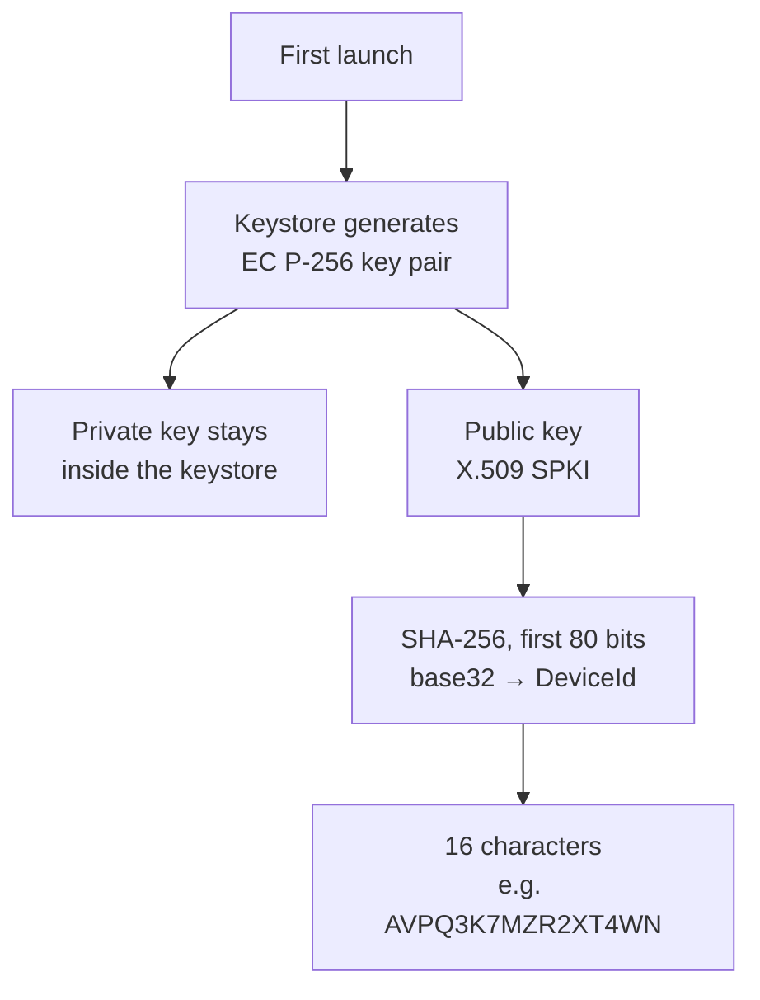
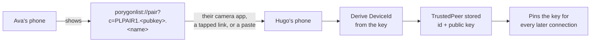
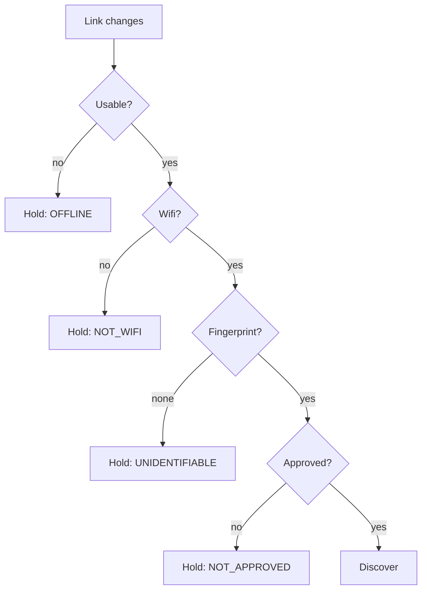
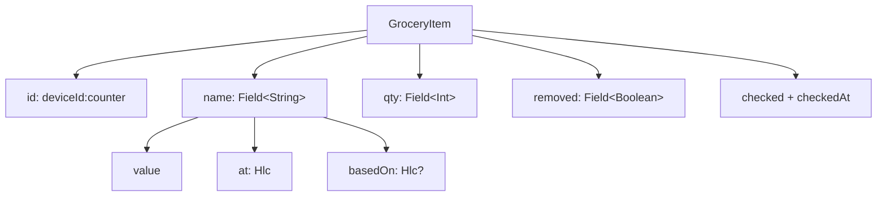
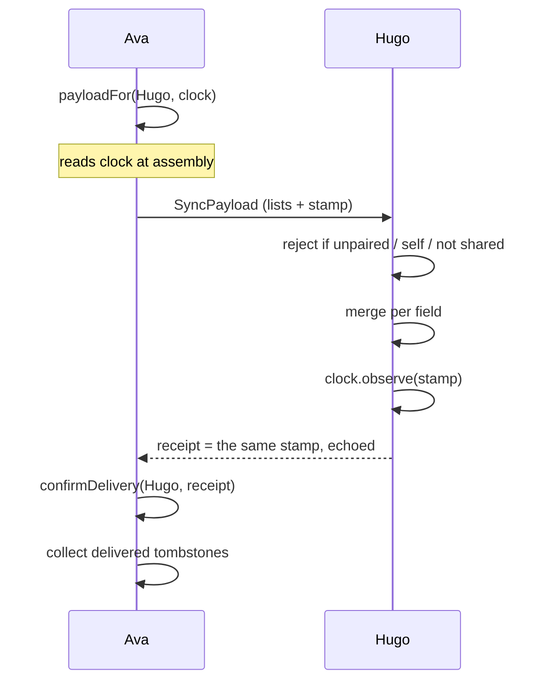
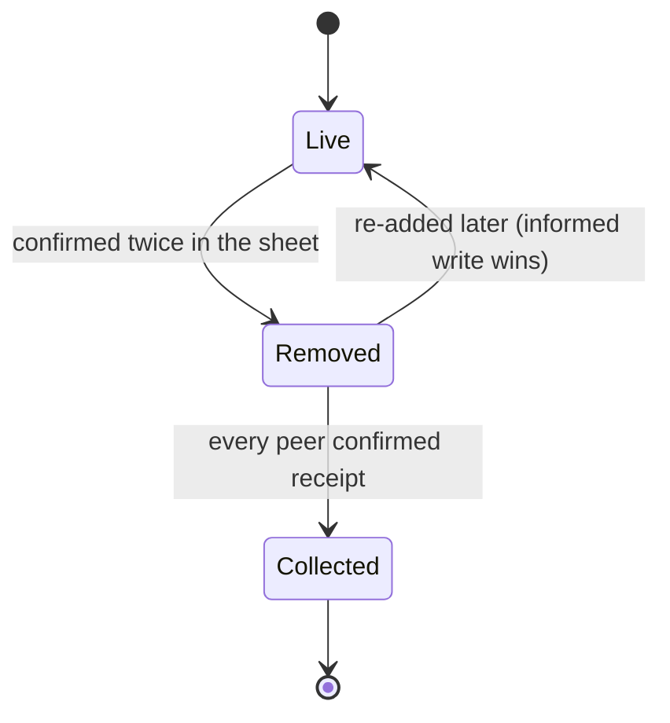

# PorygonList — architecture and status

Written 2026-09-17. This is the state of the project after the design import and
the sync foundations, and what remains before two phones can actually talk.

Committed on the `app-flow` branch.

---

## Where things stand

| Area | State |
| --- | --- |
| Interface | **Done.** All five screens from the Claude Design handoff. |
| First run | **Done.** One screen, one field: the owner's name. |
| Lists | **Done.** Make, rename, delete; staples are editable and count real use. |
| Settings | **Done.** Your name and id, paired phones, and deleting the identity. |
| Local persistence | **Done.** Hand-rolled text codec, no dependencies. |
| Device identity | **Done.** EC P-256 in the Android Keystore, id derived from the key. |
| Pairing | **Done.** QR code or tappable link, paste theirs, replace a lost phone. No camera needed. |
| Network gating | **Done.** Permission-free fingerprint decides whether to discover. |
| Merge | **Done.** Per-field, tested for symmetry and idempotence. |
| Duplicates | **Done.** Two phones adding the same thing are paired by name, not id. |
| Suggestions | **Done.** Dependency-free trie over the owner's words and a built-in list. |
| Sync protocol | **Done.** Payload, receive, receipt, tombstone collection. |
| **Transport** | **Not started.** No discovery, no socket, no TLS. |
| Fonts | **Not fetched.** `./scripts/fetch-fonts.sh` needs a machine with network. |

241 unit tests, all passing. Debug and release both assemble; lint is clean of
anything this work introduced.

The app declares exactly one permission: `ACCESS_NETWORK_STATE`. No location, no
Play Services, no Google dependencies of any kind.

---

## 1. Identity and keys

The rule the whole design rests on: **trust lives in keys, never in the network.**
An SSID is a name anything can claim, and WPA2 protects you from people outside
the café rather than the forty people inside it. So the network is treated as a
place where peers might be findable, and nothing more.

### How an identity comes to exist

`DeviceId` is *derived*, never chosen. Claiming an id requires holding the key
whose fingerprint produces it, which is exactly what a random id could not give.
`DeviceId.random()` was deleted rather than deprecated — there is no way left to
mint an identity by drawing one.

Base32 is used because its alphabet omits `0`, `1`, `8` and `9`, so there is no
`O`/`0` confusion if an id is ever read aloud.

### How two phones come to trust each other

The invite carries **no device id field**. It is derived from the key on arrival,
so there is nothing to tamper with — swap the key and you have not forged an
identity, you have presented a different one.

It carries **no secret** either. A public key is safe on a screen or in a text
message. What makes pairing trustworthy is the channel — a phone held up in front
of you — not confidentiality of the payload.

Pairing is one-directional per scan. Both phones scan each other, or one scans
and the other is scanned; there is no automatic reciprocation.

### Key facts

| Thing | Value |
| --- | --- |
| Curve | `secp256r1` (EC P-256) |
| Signature | `SHA256withECDSA` |
| Keystore alias | `porygonlist.identity` |
| Id derivation | `base32(SHA-256(SPKI))`, 80 bits, 16 chars |
| Invite format | `PLPAIR1.<base64url SPKI>.<base64url name>` |

P-256 rather than Ed25519 because keystore support for Ed25519 only arrives in
recent Android and this app ships from API 26.

**The identity cannot be exported.** Keystore keys never leave the keystore, so a
new phone is a new device that pairs again. Accepted deliberately: a list lives on
every holder's phone, so a replacement refills from the others.

---

## 2. Whether to look for peers at all

The network fingerprint is a **traffic and privacy gate**, not a security check.
Its only job is to stop the app announcing itself all day on an office or public
wifi. A network that matches is still a hostile place.

The fingerprint is `SHA-256(gateways | subnets | dnsServers)`, first 12 hex
characters, all read from `LinkProperties` with no permission. The phone's own
address is excluded because DHCP changes it; the subnet prefix does not.

**Known weakness, asserted in a test rather than hidden:** two homes on a stock
`192.168.1.1` fingerprint identically. The blast radius is bounded — discovery
starts somewhere unintended, leaking presence but no list data, and the connection
still has to authenticate. That is only acceptable because trust is in the keys.

Reading the real SSID or BSSID would need `ACCESS_FINE_LOCATION` from Android 10
onward, for a value that is spoofable anyway. Not worth the permission.

---

## 3. How a list is shaped

An item is not a row of values. The two things a person types are `Field`s, each
carrying when it was written and what it was written *against*.

- **`id` contains its creator**, so two phones adding milk while apart mint
  different ids and produce two items — never one mangled one. That case is what
  the conflict card is for, and merging deliberately does not paper over it.
- **`Hlc`** is a hybrid logical clock: `wall-counter-device`. It keeps a readable
  wall time for the UI *and* gives a total order both phones compute identically.
  Ordering by `System.currentTimeMillis()` alone is not occasionally wrong but
  confidently wrong, and the edit it discards is one somebody typed.
- **`basedOn`** is what separates a clash from a sequence. An order can tell you
  which edit is later; only `basedOn` tells you whether the later editor had *seen*
  the earlier one.
- **`checked` is deliberately not a `Field`** — ticking the same thing off twice is
  harmless, so last-writer-wins is the honest model.

`createdBy` comes from the id; `lastWriter` from the newest stamp across fields.
That split is visible in the UI: the list detail follows the last writer ("you,
just now" after you rename Hugo's item), shopping mode follows the creator ("Hugo
added this"), so ticking something off never quietly makes it your errand.

---

## 4. How a sync happens

**Whole lists, not deltas.** A grocery list is a few dozen items, so sending all of
it removes a category of bug: there is no "since when" to get wrong, and a lost
exchange costs nothing because the next one carries the same thing.

**The stamp is read at assembly, never at reply time.** It is the sender's proof of
delivery; a later reading would claim delivery of changes that never left. This is
why `payloadFor` returns the payload and the stamp together rather than letting the
caller read the clock itself.

**`receive()` refuses three things** — an unpaired sender, our own words played
back, and a list we do not already share. That last one means a peer cannot join a
list by asserting it; joining happens by invitation.

**A payload carries only lists and people.** Not approved networks, not paired
peers, not delivery receipts, not the id counter. A test asserts none of those
appear in the encoded bytes.

---

## 5. Removal, and why it is not a deletion

Dropping a row is invisible to the other phone, which reads its own live copy as
the only truth and hands the item straight back. So a removal is a stamped fact.

Nobody ever sees a tombstone. Deletion is confirmed once, at the moment it
happens, and then the item is simply gone on both phones — an earlier design with
a notice and an acknowledge button was cut as ceremony a grocery list does not
warrant.

Collection is governed by `DeliveryLog`: one `Hlc` per peer, the newest point in
*our* knowledge they have confirmed. A tombstone goes once every peer on that list
has passed it.

- **Every peer, not any peer.** One silent phone keeps every tombstone on that list.
- **Receipts only move forward.** A replayed receipt cannot walk a watermark back.
- **A peer that has never confirmed blocks collection entirely** rather than being
  assumed up to date. Forgetting is the dangerous direction.
- **No time-based expiry.** Age is not evidence of delivery; a phone off for six
  weeks still needs telling.

Removing a person from a list clears their tombstones as a side effect, and safely
— once they are off the list there is no future handover, so nothing can come back.

---

## 5b. Words on screen

**A line of interface text is a nudge, not an explanation.** This app is read
one-handed, in a shop, for eight seconds. The reader wants to know what to do
next, not why the thing works.

The rule: **say the action; cut the mechanism; cut the reassurance.** If a
sentence explains *why* the app behaves as it does, it belongs in a KDoc or in
this document, where the person who needs it will actually look. It does not
belong under a button.

What that looks like in practice:

| Before | After |
| --- | --- |
| "Tap a network's name to call it something you will recognise. Off a listed network nothing leaves the phone — your edits wait, then hand over the next time you meet on one of these." | "Tap a name to rename it." |
| "Each of you needs the other's code. Show yours, take theirs, and from then on the two phones recognise each other on any network you have both approved." | "Swap codes once, both ways." |
| "Add the things you buy over and over, and they are one tap from then on." | "The things you buy over and over." |

Two exceptions, and only two:

- **Irreversible actions keep their consequences.** Deleting the identity still
  says the lists go with it and pairings break, because that is what the person
  cannot find out afterwards. Terseness is not a licence to drop a warning.
- **One line may answer the obvious question.** The pairing screen's "No camera
  permission" exists because somebody will hunt for a scan button. One line, at
  the foot, not a card.

This was a real regression rather than a hypothetical: the screens had
accumulated about 3,800 characters of prose, and the pairing screen needed two
scrolls to reach the field its own intro paragraph was describing.

## 6. Storage and formats

| Format | Marker | Carries |
| --- | --- | --- |
| State file | `PLSTATE9` | Everything: the owner's name, staples, peers, networks, receipts |
| Sync payload | `PLSYNC1` | Lists and people only |
| Share message | `PL1` | Human-readable item run, no identity |

All three are line-based `type\|field\|field` records sharing one escaping
implementation (`sync/Records.kt`), so an item on disk and an item on the wire are
the same bytes.

No serialization dependency. That keeps the F-Droid build simple and the startup
cost near zero; at this data volume a parser this small is the right size of tool.

The state file is read lazily after the first frame, written atomically via
rename, and writes are coalesced so a burst of taps becomes one save.

`PLSTATE6` to `PLSTATE8` are still read. What separates them from the current
format — the owner's name, the staples grid, two stored sentences about a clash —
is not the kind of hole that forces a rejection: nothing has to be invented, the
name comes back blank so first run asks once, the staples come back as the default
set, and the clash sentences are written afresh from the items. An emptied grid in
a current file stays empty, because that is a state someone can actually reach.
Versions before 6 lacked identity and are still refused.

---

## 7. What is left

Everything a person can do in the app is now reachable. What is left is the
transport, in dependency order.

1. **Discovery.** `NsdManager`, framework-provided, advertising `_porygonlist._tcp`,
   started and stopped by the existing `discoveryDecision` gate.
2. **Authenticated channel.** TLS pinned to `TrustedPeer.publicKey`. The blocker
   here is already solved: **the Android Keystore generates a self-signed X.509
   certificate alongside the key**, returned by `keyStore.getCertificate(alias)`, so
   no certificate-building library is needed. Pin in a custom `X509TrustManager`.
3. **Wire it up.** `payloadFor` / `receive` / `confirmDelivery` are the seams and
   are already tested; the transport only has to move bytes between them.
4. **The QR handshake.** Done, and done without a camera. `data/crypto/QrCode.kt`
   encodes the invite, `ui/components/QrCodeImage.kt` draws it, and the invite is
   a `porygonlist://pair?c=…` link rather than a bare code.

   That link is what replaces a scanner. The *other* phone's ordinary camera app
   reads the QR and offers to open it here; the same string in a message is
   tappable. So the app ships **no camera permission, no camera library and no
   decoder** — which is the whole reason this shape was chosen.

   **Decoding was the thing worth avoiding.** Encoding is small: byte mode, level
   M, versions 1–12 is a fraction of a general encoder and hand-writing it keeps
   the dependency count at zero, exactly as the state codec does. Decoding is not:
   finding a symbol in a camera frame, correcting its perspective and running
   Reed–Solomon *correction* rather than generation. The alternative was
   `com.google.zxing:core` plus CameraX, roughly 1.5–2 MB against a 1.22 MB app.
   **If a real scanner is ever wanted, use zxing and avoid ML Kit** — ML Kit needs
   Play Services, which this phone does not have.

   **Opening a link is not an act of trust.** The intent filter is `BROWSABLE`, so
   anything on the phone can hand us one. It fills the pairing field and opens the
   screen; the person still answers "someone new, or a replacement?". Nothing is
   paired without that tap, and `MainActivity` deliberately does not even decode
   the link. `PairingCodec.decode` still reads the bare `PLPAIR1.…` form, so codes
   sent before this keep working.

   **The encoder is verified, but not by the committed tests.** `QrCodeTest` checks
   structure only — size, finder and timing patterns, quiet zone. Proving the
   payload needs a reference decoder, and the whole point was not to carry one. It
   was validated out of band against OpenCV: all 287 payload lengths from 1 to 287
   bytes round-tripped, covering every version in the table, both character-count
   widths and every multi-block interleaving layout, plus a decode straight off a
   screenshot of the phone. Re-run that sweep if the encoder is ever touched.

   **The one thing not verified on hardware**: that a given camera app offers to
   open a custom scheme. Firing the intent works, and the flow was driven end to
   end from both a cold start and a running app, but "point a real camera at it"
   needs two devices.
5. **Fonts.** Run `./scripts/fetch-fonts.sh`, commit the TTFs, swap the two
   families in `theme/Type.kt`.

### Smaller loose ends

- **The seed still ships a fake partner and fake networks.** `avademo01` and
  `seed01`–`seed03` exist so the design's screens have content; neither can ever
  match a real phone or a real link. With pairing real they now actively mislead —
  the demo partner appears in People having never been paired with. **This is the
  next thing to decide:** what a first run should actually open onto.
- **Field clashes are reported but nothing renders them.** `ListMerge.clashes` comes
  back populated for two blind edits to the *same* item; only `duplicates` — the same
  thing added on both phones — reaches a card. What to do with a concurrent rename is
  still open, probably "take the later one silently".
- **Only one card at a time.** `AppState.conflict` holds a single pair. A second
  duplicate arriving before the first is answered waits rather than replacing it, so
  nothing is lost, but it is not shown until the next handover after the first is
  answered.
- **A list's own name is not a `Field`**, so concurrent renames of "Weekly shop" are
  not symmetric. Lists can now be renamed from the interface, which makes this
  reachable rather than theoretical.
- **Deleting a list is local.** It goes from this phone; the people it was shared
  with keep their copies. Propagating it would need a tombstone for the list itself,
  and letting one phone wipe a shared list off everyone else's is not obviously
  right.
- **Phone replacement needs a deliberate re-pair.** A replaced handset has a new
  `DeviceId` and is rejected as an unknown peer until scanned again. Correct, but
  worth knowing — the pairing screen now offers "this is X's new phone" for exactly
  this case, which retires the dead id instead of leaving it waited on.

---

## 8. Decisions worth not relitigating

- **Serverless.** No backend, no account, no relay. Peer to peer on an approved
  local network, with a text message as the fallback when off one.
- **The network is never a trust input.** It gates traffic and nothing else.
- **Identity is tied to the installation.** No export, no backup. A new phone pairs
  again and refills from the other holders.
- **Confirm at the point of action**, not an undo trail afterwards. A grocery item
  is cheap to retype; ceremony costs more attention than the mistake it prevents.
- **Merge automatically, surface only genuine clashes** — where neither editor had
  seen the other.
- **No new dependencies** unless they earn it. Currently zero beyond AndroidX and
  Compose.
